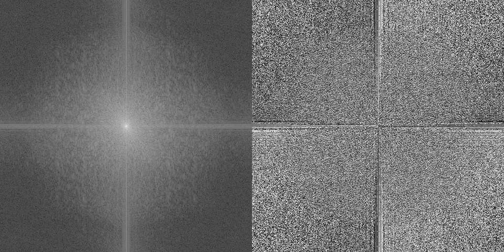
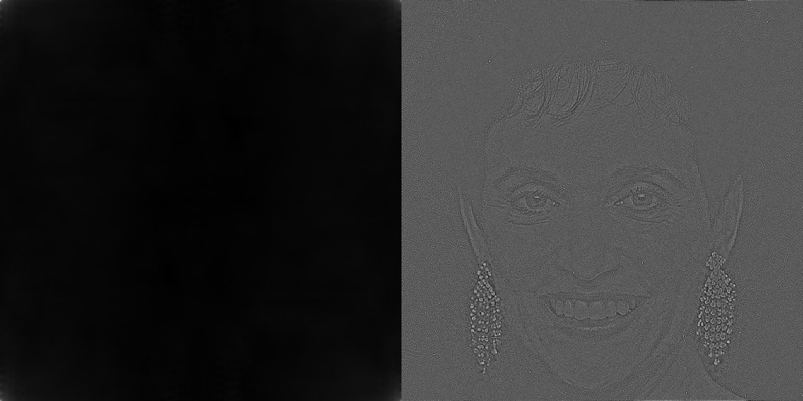
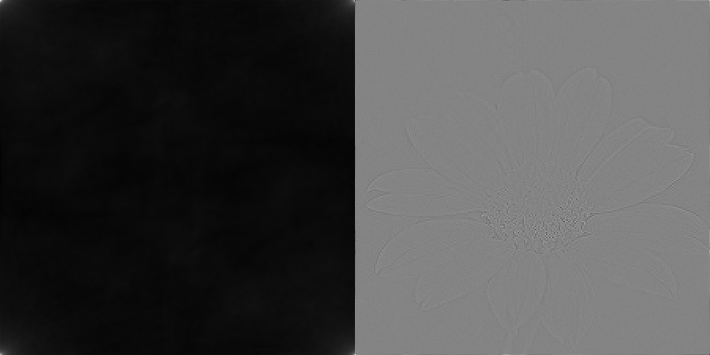
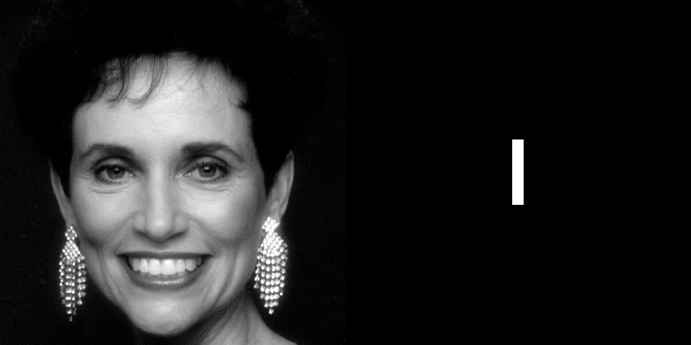
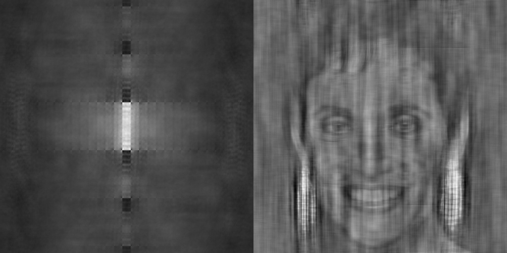
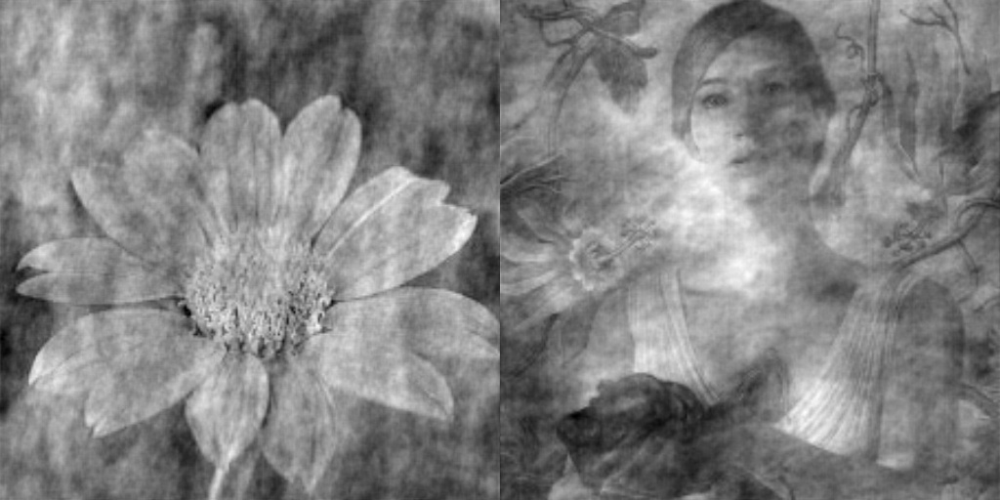
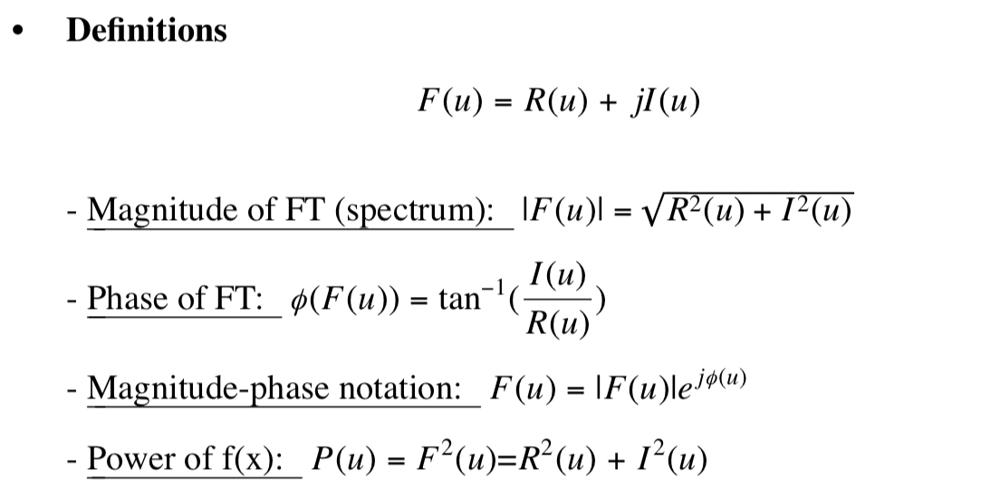

# Image Processing Using Fourier Transformation And Inverse One 

## ✨ <font style="color:blue">This is a command-line image processing tool about Fourier Transformation.</font>

## 👉 Some output by experiments : 

| Image | Show Spectrum / Phase |
| :---: | :---: |
|   |  | 
|   |  | 

| Image | Reconstruct By One |
| :---: | :---: |
|   |  |
|   |  |

| Image | Reconstruct By Two |
| :---: | :---: | 
|   |  |
|   |  |

---

## 1.   Inside, there are some files and directory :
    
1. [fft_images_ifft.py](fft_images_ifft.py) : 

    * Main program to run.
    
    * There are three kinds of operation :
    
        + Show only __Spectrum__ and __Phase__
    
        + Reconstruct using __only__ __Spectrum__ or __Phase__
    
        + Reconstruct using __each image's (two image)__ __Spectrum__ and __Phase__
    
    * Using default output directory : __output_directory_default__ , if you specify one, you need to use the command __『 --output 』__
    
    * If you choose __option 2__, you need to specify images using __『 --secondimage 』__.Otherwise, the second image is set as same as the first image.
    
    * When operating for " Showing spectrum and phase " or " Reconstruct using only spectrum or phase ", we simply use the __firstimage__ option as default.

2. [output_directory_default](output_directory_default/) : 

    * Inside, we have five images :
        
        +  [img_original_woman.jpg](output_directory_default/img_original_woman.jpg)
        
        +  [spectrum_and_phase_woman.jpg](output_directory_default/spectrum_and_phase_woman.jpg)
        
        +   [spectrum_and_phase_only_version_woman.jpg](output_directory_default/spectrum_and_phase_only_version_woman.jpg)

        + [imgage_combine_original_both.jpg](output_directory_default/imgage_combine_original_both.jpg)
        
        + [imgage_combine.jpg](output_directory_default/imgage_combine.jpg)

4. [output_directory_others](output_directory_others/) :

    * Inside, we have also eight images :
        
        +  [img_original_flower.jpg](output_directory_others/img_original_flower.jpg)

        +  [img_original_mother.jpg](output_directory_others/img_original_mother.jpg)
        
        +  [spectrum_and_phase_flower.jpg](output_directory_others/spectrum_and_phase_flower.jpg)

        +  [spectrum_and_phase_mother.jpg](output_directory_others/spectrum_and_phase_mother.jpg)
        
        + [spectrum_and_phase_only_version_flower.jpg](output_directory_others/spectrum_and_phase_only_version_flower.jpg)

        + [spectrum_and_phase_only_version_mother.jpg](output_directory_others/spectrum_and_phase_only_version_mother.jpg)
        
        + [imgage_combine_original_both.jpg](output_directory_others/imgage_combine_original_both.jpg)
        
        + [imgage_combine.jpg](output_directory_default/imgage_combine.jpg)

---

## 2.   Desciption of code :

### For All Operaiton, I Use The Definition, Where Teacher has Mentioned In Class :


* First, we read image as a gray scale image, then resize that to (512,512)

* Then, we use __fft__ and __fftshift__ to transform image from spatial domain to frequent domain by using __Fourier Transforamtion__

* After that, we do three operation : 

    + Showing Spectrum and Phase :
        
        a.  For Spectrum, we use __np.abs__ to get its absolute value, or you can say its distance in __complex plain__. But if we have to show that image, we have to use __np.log__ to small the value and so that we can easily view the image, otherwise, it just almost black.

        b.  For Phase, we use  __np.angle__ to get its tan-1 from it real and imaginary number.

    + Reconstruct Using Only Spectrum or Phase :

        a. As we mentioned above, we use that spectrum without log and phase.

        b. If we reconstruct using only spectrum, then we set the angle as 0 using in imaginary number __( np.exp(1j*np.angle(0)) )__, and multiply these two.

        c. If we reconstruct using only Phase, then we set the real number which also means absolute number as __1__, and multiply these two.

    + Reconstruct Using Each Image's Spectrum or Phase :

        a. As we mentioned above, we use each image's spectrum without log and phase

        b. Then using the method mentiond in second operation, combine two images' spectrum and phase to reconstruct.

* Then, we use __ifftshit__ and __ifft__ to inverse from frequency domain to spatial domain.

* Finally, we just combine the image in specific opertaion, then combine the image and show, then also save to the output directory.

* Congraudulation, we just finish ! !

---

## 3.   Simply Run Command Below :

```
$ python fft_images_ifft.py --firstimage [your/first/image/path] --choice [the choice you want] --output [the/output/you/want]
```

or

```
$ python fft_images_ifft.py --firstimage [your/first/image/path] --secondimage [your/second/image/path] --output [the/output/you/want] --choice [the choice you want]
```

Also , there some helping mesage about parse arguments :

```
usage: Process Image With Fast Fourier Transformation : About Phase and Spectrum.
       [-h] --firstimage path/to/image [--secondimage path/to/image]
       [--output path/to/output/directory] --choice {0,1,2}
Process Image With Fast Fourier Transformation : About Phase and Spectrum.: error: the following arguments are required: --firstimage, --choice
 ```

##  Here is a simply introduction of this tool.
