# Image Processing To Detect Harris Corner 

## ✨ <font style="color:blue">This is a command-line image processing tool about Harris 「 Corner 」 Detection.</font>

## 👉 Some output by experiments : 

| Image | Harris Corner Comparasion (Left:My Implementation ; Right:CV Tool) |
| :---: | :---: |
| 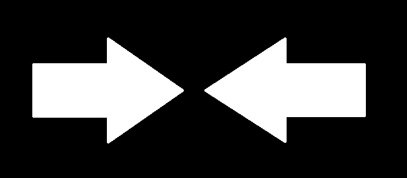 |  | 
|  | 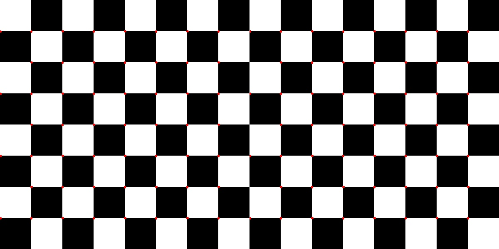 | 
| 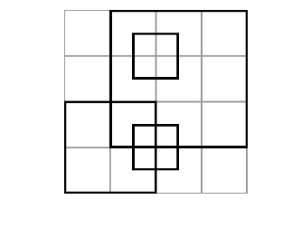 | 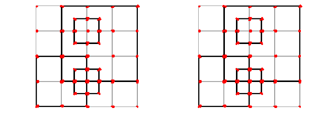 |
| 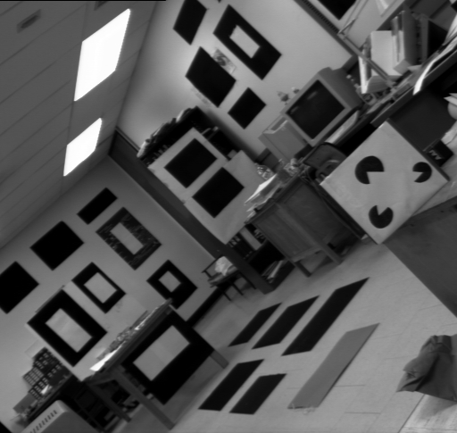 | 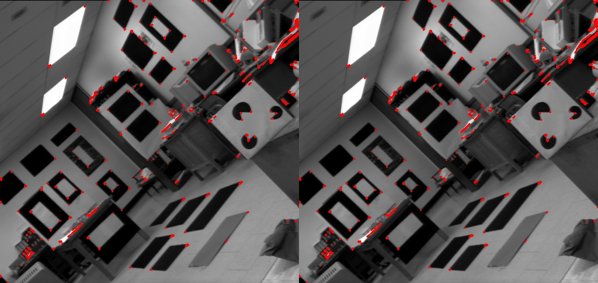 | 
| 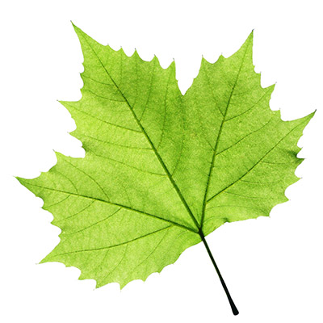 |  | 

---

## 1.   Inside, there are some files and directory :
    
1. [harris_corner.py](harris_corner.py) : 

    * Main program to run different image, you can change the image inside the program
    
    * First, we implement the method (formula) mentioned in textbook (And some professional website), and the output is going to be compare with the ouput which is from Opencv Tool.
    
---

## 2.   Desciption of code :

### For All Operaiton, I Use The Definition, Where Teacher has Mentioned In Class :
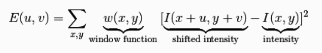

* First, we read image as a gray scale image

* Then, use sobel operators to find x-axis gradient and y-axis gradient

* After that, we can see this formula : 

    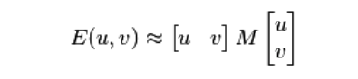
    
    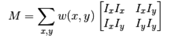

    👉 Above, we can get that approximated formula by taylor's expansion and compute in matrix operation

    Beacuse of the above formula :

    + We compute the number for Sxx which is Ixx * Ixx

    + We compute the number for Sxy which is Ixx * Iyy
        
    + We compute the number for Syy which is Iyy * Iyy

    + Besides, the other point of the formula is the window size, which is to be use for sliding through the whole image. We can use 3*3 window size, or 5*5. In formula, we represent this by w(x,y).

* Then, compute the trace and determinant, which mentioned before in Linear Algebra Class :

    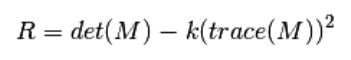
    
    

    + by the code below, we set k parameter as a checking variable, we usually use this to set difference between corner, edge and flat area
    
        ```
            # Find determinant and trace, use to get corner (response)
            # k is the parameters for the formula
            k = 0.04
            det = (Sxx * Syy) - (Sxy**2)
            trace = Sxx + Syy

            # the most important is here, compute the "r"
            r = det - k*(trace**2)
        ```

* Finally, we set a threshold to get distinct corner areas

    + here, we can set a threshold using a certain value, like 10000

    + or, we can also use the r value we compute above, and set threshold as t times max(r), where t variable is a small value like 0.01 ..., like this :
        ```
        # set for my function
        if new_r_image[i][j] > threshold*new_r_image.max() :
            cv2.circle(image_rgb_mine, (j, i), 1, (0, 0, 255), -1)
        ```

    + if we find the point, we draw a small circle to label it.

* Congraudulation, we just finish ! !

---

## 3.   Simply Run Command Below :

```
$ python harris_corner.py --firstimage 
```

## P.S : I implement this by studying the tutorial from the website [__here__](https://muthu.co/harris-corner-detector-implementation-in-python/)
##  Here is a simply introduction of this tool.
